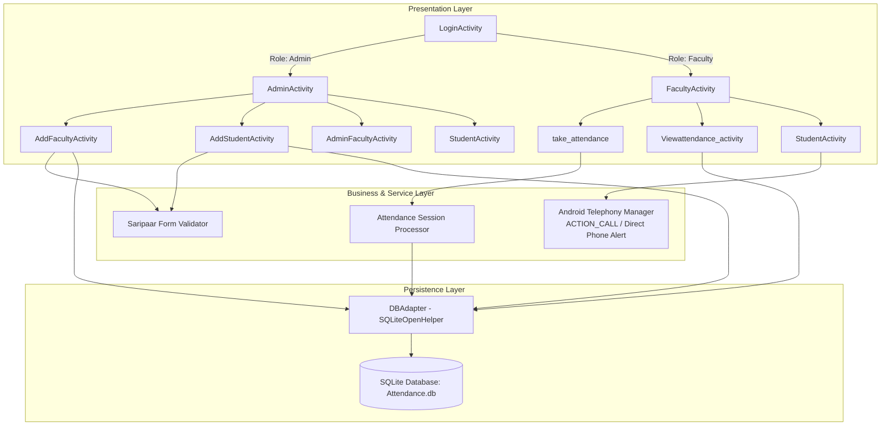
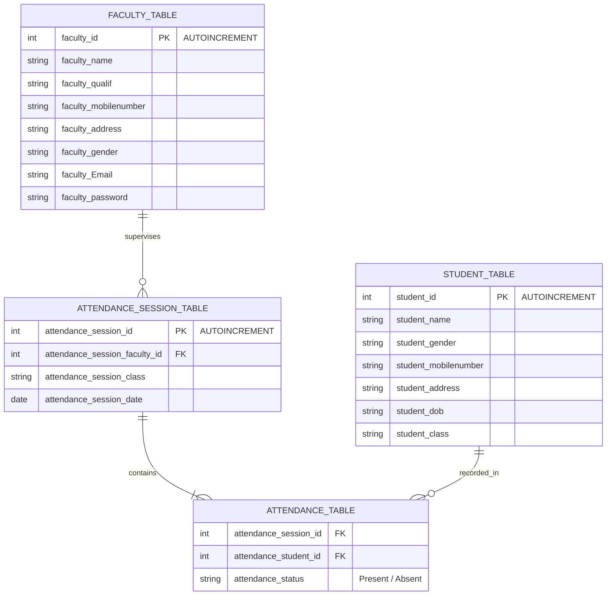

<div align="center">

# 📱 Parent Communication Register (PCR)
### Academic Attendance Tracking & Direct Parental Communication Mobile Application for Android

[-3DDC84?logo=android&logoColor=white)](#-tech-stack--dependencies)
[](#-tech-stack--dependencies)
[](#-build--installation)
[-003B57?logo=sqlite&logoColor=white)](#-database-schema--entity-relationships)
[](#-tech-stack--dependencies)
[](#-key-features)
[](LICENSE)

**English** | [العربية](#-نظرة-عامة-باللغة-العربية)

</div>

---

## 🌟 Overview

**Parent Communication Register (PCR)** is a native Android application engineered for schools, universities, and educational institutions. It streamlines daily student attendance recording, provides real-time attendance telemetry for faculty and administrators, and bridges the gap between schools and parents with direct one-touch cellular telephony integration (`CALL_PHONE`).

PCR eliminates paper-based attendance registers by offering a secure, offline-first embedded SQLite storage engine with automated session linking, role-based workflows (Admin vs. Faculty), and granular attendance reports.

---

## 🏗️ Architecture & Component Flow

The application follows an Android architectural model combining **ViewBinding**, **Data Access Objects (DAO)** via a centralized `DBAdapter`, and declarative form validation via **Android Saripaar**.



---

## 🗄️ Database Schema & Entity Relationships

PCR manages academic records through four normalized relational tables managed by `DBAdapter`:



---

## ✨ Key Features

- **🔐 Dual-Tier Role Based Access Control**:
  - **Administrator Dashboard**: Register faculty members, manage instructor credentials, enroll new students with demographic data, and oversee all academic cohorts.
  - **Faculty Dashboard**: Filter by assigned class, initiate daily roll-calls, record presence/absence flags, and inspect historical session logs.
- **⚡ Rapid Roll-Call Attendance Session**:
  - Automated session creation with timestamp and teacher identifier.
  - Quick-toggle status switches (`Present` / `Absent`) with high-contrast UI states.
- **📞 One-Touch Parental Call Dispatch**:
  - Directly connect faculty members to a student's parent/guardian upon absence using the Android native dialer/telephony stack (`CALL_PHONE` intent).
- **📋 Rule-Based Form Validation**:
  - Employs **Android Saripaar** annotation-based validation for email formatting, mobile number lengths, and required profile fields.
- **🖼️ Profile Media Ingestion**:
  - Integrated image picker (`com.github.Drjacky:ImagePicker`) and circular image rendering (`de.hdodenhof:circleimageview`) for avatar customization.
- **📴 Offline-First Reliability**:
  - Zero cloud dependency required for operational core: all transactions commit locally to transactional SQLite with atomic integrity.

---

## 🛠️ Tech Stack & Dependencies

| Layer | Technology | Description |
|---|---|---|
| **OS Target** | Android 5.0 to 14 | `minSdk = 21`, `targetSdk = 34`, `compileSdk = 34` |
| **Language** | Java 8 | Modern lambdas, streams, and bytecode desugaring |
| **Build Tool** | Gradle 8.7 (Kotlin DSL) | `build.gradle.kts` with Version Catalog `libs.versions.toml` |
| **View Layer** | Android ViewBinding | Type-safe view lookups replacing unsafe `findViewById` |
| **UI Components** | Google Material Components | Material buttons, CardViews, TextInputLayouts |
| **Form Validation** | Android Saripaar `2.0.3` | Declarative field validation engine |
| **Image Picker** | Drjacky ImagePicker `2.3.22` | Camera & Gallery profile image capture |
| **Avatar Display** | CircleImageView `3.1.0` | Circular avatar masking for students and faculty |
| **Local Storage** | Android SQLiteOpenHelper | ACID-compliant relational embedded database |

---

## 📁 Project Directory Layout

```text
PCR/
├── app/
│   ├── build.gradle.kts                      # Module-level Gradle configuration (SDK 34)
│   ├── proguard-rules.pro                   # R8 / ProGuard optimization rules
│   └── src/
│       ├── main/
│       │   ├── AndroidManifest.xml          # Permissions (CALL_PHONE) & Activity declarations
│       │   ├── java/com/example/parentcommunicationregistar_app/
│       │   │   ├── Login_activity.java      # Auth gateway (Admin vs Faculty)
│       │   │   ├── Admin_activity.java      # Administrator executive console
│       │   │   ├── AdminFacultyActivity.java# Faculty registry & roster management
│       │   │   ├── AddFactultyActivity.java # Instructor registration & validation
│       │   │   ├── Faculty_Activity.java    # Faculty session launcher & tools
│       │   │   ├── AddStudentActivity.java  # Student onboarding & contact registration
│       │   │   ├── StudentActivity.java     # Student directory with direct parental calling
│       │   │   ├── take_attendance.java     # Daily roll-call attendance submission
│       │   │   ├── Viewattendance_activity.java # Historical records & attendance analytics
│       │   │   ├── AttendanceAdapter.java   # RecyclerView adapter for dynamic roster rows
│       │   │   ├── HomeFragment.java        # Dashboard overview fragment
│       │   │   ├── bean/                    # Data transfer objects (DTOs)
│       │   │   │   ├── AttendanceBean.java
│       │   │   │   ├── AttendanceSessionBean.java
│       │   │   │   ├── FacultyBean.java
│       │   │   │   ├── StudentBean.java
│       │   │   │   ├── UserBean.java
│       │   │   │   └── ApplicationContext.java
│       │   │   └── db/
│       │   │       └── DBAdapter.java       # Centralized SQLiteOpenHelper & CRUD operations
│       │   └── res/                         # Vector drawables, layouts, and navigation graphs
├── gradle/
│   ├── libs.versions.toml                   # Centralized Gradle version catalog
│   └── wrapper/                             # Gradle wrapper binaries
├── build.gradle.kts                         # Root project build script
├── settings.gradle.kts                      # Plugin repositories & project naming
└── README.md
```

---

## 🚀 Build & Installation

### Prerequisites
- **Android Studio** (Hedgehog 2023.1.1 or Ladybug / Jellyfish recommended).
- **JDK 17** configured as the Gradle JDK.
- **Android SDK API 34** installed via SDK Manager.

### 1. Clone the Repository
```bash
git clone https://github.com/Brosfeer/PCR.git
cd PCR
```

### 2. Build via Command Line
```bash
# Grant execution permissions to Gradle wrapper
chmod +x gradlew

# Compile debug APK
./gradlew assembleDebug
```

The compiled APK will be generated at:
```text
app/build/outputs/apk/debug/app-debug.apk
```

### 3. Install on Physical Device or Emulator
```bash
adb install -r app/build/outputs/apk/debug/app-debug.apk
```

---

## 🇸🇦 نظرة عامة باللغة العربية

تطبيق **سجل تواصل أولياء الأمور (PCR - Parent Communication Register)** هو تطبيق أندرويد متكامل موجّه للمؤسسات التعليمية والمدارس لإدارة الحضور والغياب اليومي للطلاب، وربط الكادر التعليمي بأولياء الأمور بشكل مباشر عبر الاتصال الهاتفي الفوري (`CALL_PHONE`).

### أبرز الخصائص التقنية:
1. **نظام صلاحيات ثنائي (Admin / Faculty)**:
   - لوحة تحكم الإدارة: إضافة وتعيين الكادر التعليمي، تسجيل بيانات الطلاب، وإدارة الفصول.
   - لوحة المعلم: تسجيل الحضور اليومي، رصد الغياب والحضور، واستعراض الإحصائيات التاريخية.
2. **اتصال مباشر بأولياء الأمور**: إمكانية الاتصال الفوري برقم ولي أمر الطالب مباشرة من التطبيق عند رصد حالة الغياب لتأكيد المتابعة.
3. **قاعدة بيانات SQLite محلية مدمجة**: حفظ كامل السجلات والفصول والجلسات محلياً مع موثوقية عالية وسرعة فائقة بدون الحاجة للاتصال بالإنترنت.
4. **التحقق الذكي من البيانات (Saripaar)**: التحقق التلقائي من صحة أرقام الهواتف، البريد الإلكتروني، والبيانات الإلزامية قبل الحفظ.
5. **معمارية Android ViewBinding**: ربط العناصر البرمجية بالواجهات بكفاءة وأمان كامل وتفادي مشاكل الأداء.

---

## 👨‍💻 Author & Engineering Leadership

Engineered with architectural discipline by **Sharaf** ([@Brosfeer](https://github.com/Brosfeer)) — Principal Mobile & Systems Architect & Founder of **SayaSky Studio**.

- **GitHub**: [@Brosfeer](https://github.com/Brosfeer)
- **Studio**: **SayaSky Studio** ([Google Play](https://play.google.com/store/apps/details?id=com.sayasky.kiddyzonetown&hl=ar))
- **Specialization**: Mobile Systems, Real-Time Telemetry & Clean Architecture

---

## 📄 License

Distributed under the **MIT License**. See [LICENSE](LICENSE) for details.
